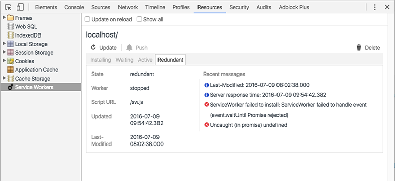

# 概述
PWA（渐进式网页应用）是谷歌推出的一个可以媲美原生app用户体验的web网页。具体涉及的技术有：
- service worker
- notification/push api（需翻墙）
- manifest

# 优点
- 渐进式：可以运行所有浏览器， 再支持的PWA中使用PWA功能，不支持的浏览器也能正常访问
- 响应式：可以适配不同大小的屏幕
- 允许离线访问：service worker的缓存机制
- 媲美原生APP：图标，启动画面，全屏体验,独立与浏览器进程
- seo友好：Manifest
- 交互性强：可推送notification api
- 安装简单：浏览器点击“添加到主屏”即可

# 技术点
## Service Worker（以下简称SW）
类似于代理，所有浏览器发出去的http请求都会被拦截， 然后对资源进行缓存。 跟Web Worker一样，是独立于浏览器的进程，能够在后台运行

不过由于安全策略，SW只能运行在https协议，或者本地localhost/127.0.0.1开发域名下。

### 生命周期

xs
图片来源自：[bitsofcode](https://bitsofco.de/the-service-worker-lifecycle/?utm_source=javascriptweekly&utm_medium=email)

一共有6个
#### parsed

当第一次尝试注册SW， 用户代理会实例化脚本并获取入口（entry point），如果实例化成功，就可以饮用SW对象了，这个对象会包含SW的状态信息和scope信息。对应的是register方法

```js
if('serviveWorker' in navigator) {
    navigator.serviceWorker.register('./sw.js')
    .then((registration) => {
        console.log('registration successed')
    })
    .catch((err) => {
        console.log('registration failed')
    })
}
```
需要注意的是， 成功注册并不代表已经完成安装或激活， 仅仅是该脚本被成功的实例化而已， 它跟document同域。一旦实例化之后便向下一个状态installing转移

#### installing
UA将尝试安装SW，状态也将变为 *installing* ， 对registration.installing状态当子对象进行检查
```js
navigator.serviceWorker,register('./sw,js')
.then((registration) => {
    // SW state is Installing

})
```
在installing状态中， install时间会被出发， 可以缓存静态文件
```js
self.addEventListener('install', (e) => {
    e.waitUntil(
        caches.open(currentCacheName).then((cache) => cache.addAll(arrayOfFilesToCache))
    )
})
```
如果有*event。waitUntil*方法存在， 那么installing事件在promise resolve掉之前状态不会发生改变， 如果Promise被拒绝了， install事件将会失败，SW也将会被丢弃。
```js
self.addEventListener('install', (e) => {
    e.waitUntil(return Promise.reject());// failure
})
```
#### installed/waiting
当成功安装后， SW便会更改为此状态，在此状态中，SW是可用， 但是还是没有被激活， 还没有在document的控制里， 而是正在等待当前的worker获取控制权
在registration对象中， 可通过registration.waiting来检查此状态
```js
navigator.serviceWorker.register('sw.js')
.then((registration.waiting) => {
    // sw is waiting
})
```
此状态是一个通知app使用者可以更新新的version，或自动更新。

#### activating
此状态只在下列场景中触发：

- 如果当前没有活动的worker
- 如果*self。skipWaiting()*方法被调用
- 如果用户已经导航出本页面，释放之前活跃的worker
- 如果又一个具体的过期时间被传入， 释放之前活跃的worker

在此状态中， *activate*事件被触发， 在典型的触发事件，通常用来清除old的caches
```js
self.addEventListener('activate', (e) => {
    e.waitUntil(
        caches.keys().then((cacheNames) => {
            return Promise.all(cacheNames.filter((cacheName) => {
                return cacheName !== currentCacheName;
            }).map((cacheName) => {
                return caches.delete(cacheName);
            }))
        })
    )
})
```
与之前的installing一样， waitUntil只在所有的promise都被resolve掉之后状态才发生转移，否则为failed并且该SW被抛弃

#### activated
如果激活成功， SW将会转移到该状态，它将成为一个活跃的并且拥有document所有控制权的worker， 在registration对象中，可以通过registration.active检测
```js
navigator.serviceWorker.register('sw/js')
.then((registration) => {
    if (registration.active) {
        // SW is active
    }
})
```
当为active时,可以处理两个函数事件: 1 *fetch* 2 *message*

```js
self.addEventListener('fetch', (e) => {
    // fetch handler
})
self.addEventListener('message', (e) => {
    // message handler
})
```
#### Redundant
这是最后一个生命周期, 前面所说当会被丢弃的都会到这里来

- install失败
- activate失败
- 一个新的SW作为活跃的SW替换原有的.

前两个是可以在chrome devTool中查看:



需要注意的是, 如果之前的SW已经处在激活状态, 并且对document有着控制权, 那么新的SW也对此document有控制权.

### Manifest文件

*添加到主屏*将会使用到manifest.在之前说到对优点的第四条: *媲美原生APP：图标，启动画面，全屏体验,独立与浏览器进程*都需要manifest的支持.

一个典型的*manifest.json*文件会位于网站的根目录.
```js
{
  // PWA名
  "name": "Todo",
  // 一系列适应不同型号设备的icon
  "icons": [
    {
      "src": "android-chrome-192x192.png",
      "sizes": "192x192",
      "type": "image/png"
    },
    {
      "src": "android-chrome-512x512.png",
      "sizes": "512x512",
      "type": "image/png"
    }
  ],
  // 主题颜色, 将会影响手机状态栏的颜色
  "theme_color": "#ffffff",
  // 背景颜色.
  "background_color": "#ffffff",
  // 启动地址
  "start_url": "src/index",
  // 表示类似原生APP全屏方式启动
  "display": "standalone"
}
```
以下地址可以在线生成*manifest.json*文件
- [https://app-manifest.firebaseapp.com/](https://app-manifest.firebaseapp.com/)
- [https://tomitm.github.io/appmanifest/](https://tomitm.github.io/appmanifest/)

到目前为止, IOS尚未支持PWA, 但是可以通过由苹果公司提供到HTML标签使web页面获得和原生应用类似到效果
```js
// 应用图标
<link rel="apple-touch-icon" href="apple-touch-icon.png">
// 启动画面
<link rel="apple-touch-startup-image" href="launch.png">
// 应用名称
<meta name="apple-mobile-web-app-title" content="Todo-PWA">
// 全屏效果
<meta name="apple-mobile-web-app-capable" content="yes">
// 设置状态栏颜色
<meta name="apple-mobile-web-app-status-bar-style" content="#fff">
```
