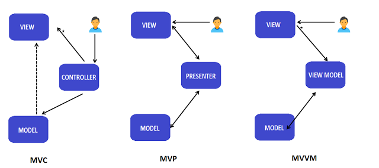
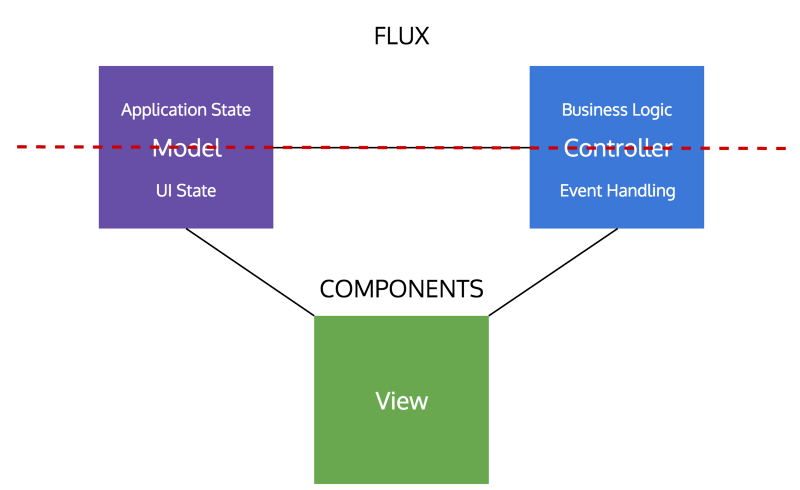

React, VUE 这些框架都借用了 MVC 的设计模式来进行数据, 视图, 逻辑的管理, 但是在跟同事沟通过程中, 原来不仅仅是前端, 任何语言都有类似的概念, 这是个软件界通用的设计模式.

设计模式, 模式二字听起来就很高深, 在写代码的时候肯定不如自己一套撸下来的爽, 设计模式好处

1. 后期维护方便, 因为可以解耦
2. 别人能快速看懂
3. 跟人沟通的时候会在这个"共识"下进行讨论, 是一个框架, 彼此都比较清楚.

说说相关的, MVC, MVVM, MVP 这三种模式, 在头图中已经有展示了.



[图片来源](https://medium.com/@ankit.sinhal/mvc-mvp-and-mvvm-design-pattern-6e169567bbad)

## MVC

### Model

需要被展示出来的数据. 表示一系列描述业务逻辑的类的集合(可分为业务 model 和 数据 model).也为数据定义了业务规则, 表示数据如何被改变和控制.

### View

代表 UI 组件, 比如 XML 和 HTML 等, view 展示的数据是从 controller 来的, View 监视 model 任何状态的变化并且展示最新的 model, model 和 view 的彼此交互是使用的观察者模式, view 中不包含任何的业务逻辑

### Controller

负责处理用户输入请求(如果有必要可进行数据校验),并将交互的数据信息传递到 model, 通常是作为 view 和 model 的中间件.

## MVP

### Model和 View

同上

### Presenter

从 View 中接收用户数据, 借 Model 处理数据, 并将结果传回给 View, Presenter 通过**接口**与 view 通信, 接口被定义在 presenter 的类中, view 组件实现这个接口并且以任何想要的方式渲染数据

presenter 操作 model 并且更新 view, view 和 presenter 是完全解耦的, 只能通过接口进行通信, 这样可以 mocking view 来做单元测试, 这是使用 MVP 比 MVC 更简单的地方.

## MVVM

支持View 和 ViewModel 双向数据绑定, 可以自动的在 View 和 ViewModel 中传递更改,  通常 View-Model 利用观察者模式来通知更改到 Model

### ViewModal

负责暴露方法, 属性来维护 view 的状态, view 中的 action 的结果就是操作 model, 并且触发 view 自己的事件. view 有一个对 View-Model 的引用, 但是 View-Model 不知道 View 的存在.在 View 和 ViewModel 中是多对一的关系, Views 之间是完全独立的

双向数据绑定保证 models 和 ViewModel 的属性会同步到 view 中, 非常适合双向数据绑定的应用.

这三种模式有些难以区分, 我的理解是

- MVC, 事件触发首先是到 controller, controller 负责把事件更改的数据放到 model 中,model 是该模式下的核心, model 和 view 都没有任何对 control 的引用(是单向的), 可对多个 views. view 的数据直接来源 model
  - 优势:
    1. 并行开发: model 和 view 以及 controller 的耦合程度很低, 可各自开发各自的部分
    2. 高内聚: 可以使逻辑和 actions 一起放进 controller 中, 对某一个具体 model 的 views也可以归类放在一起
    3. 低耦合: 这是 MVC 的本质.
    4. 修改简易: 责任划分独立, 后去维护和开发都较为简单
    5. 单个 model 对应多个 view, 复用性.
  - 缺点:
    1. 代码的指向性: 引入了一个新的抽象层, 肯定不如一套撸的爽
    2. 多方一致性: 将一个 feature 分成了零散的三块, 需要开发者和维护者去维护这样的一致性
    3. 集群导致优劣互换: 应用总是趋向越来越重的交互, 每个需求的计算和状态也会趋向 3 个 part 中的一个, 会将 MVC 标榜的优势给灭掉
    4. 过重的复用: 因为如 3 所说, 应用会典型的集群到某一个上面去, 其他部分就会进行复用
    5. 学习曲线较高
    6. 缺乏持续增长的优势: UI 应用已经被 components (组件化)了, 通过该方法实现了代码复用和相互独立, MVC没有更多的优势了
    [参见维基百科](https://en.wikipedia.org/wiki/Model%E2%80%93view%E2%80%93controller#cite_note-15)
- MVP, 事件触发起始于 view, view 和 presenter 的地位是平等的, **一个 view 对应一个 presenter**, view 和 presenter, presenter 和 model 都会彼此引用. 适合view 比较特别的组件, 不利于复用, view 不部署任何业务逻辑, 业务逻辑都放在了 presenter 中. view 不直接使用 model, 都是从 presenter 转运.
对比 MVC 来看 presenter 和 controller 有类似之处, 都是处理 view 中的交互逻辑, 且连接了 view, 不同点在于

  1. 映射模式, controller 是一对多个 views, presenter 和 view 则为一对一.
  2. MVC 中 model 不知道 controller 的存在, MVP 中, model 的数据是可以直接饮用 presenter 的.

- MVVM, 事件触发也始于 view, 在这时候, 引用关系就变成 view 去引用 ViewModel 了, ViewModel 是不知道 View 的存在. 与 MVC 类似, 一个 VM 可对应多个 V. View 数据来源是 VM 而不是 Model.

这里跟 MVC 不同之处在于:

  1. VM 不控制 V, 设甚至都不知道 V 的存在.
  2. VM 与 model 相互引用.

以上是单独对每一种模式的解释以及区分, 现有框架如 React, Facebook 官方把它比作为 MVC 里面的 V, 我们需要做的就写入 M 和 C, 后来有了 redux, 可以集中处理 M 了, 开发者就简化为写 C 即可. 这样一套内部的设计模式, 可以让一个初学者也按照这么去写出不错的代码, 虽然他有可能并不十分了解这套模式.

但是我们应该是低估了 react 的另一个东西就是组件化, 也就是 **Views+Event Handling + UI State**



这是传统 MVC 的变体, View + UI State + Event Handling 可以看成是组件 COMPONENT, 而红色虚线往上 的 Application 和 Business Logic 就是 FLUX 目标解决的问题, 也就是单向数据流.

具体的 react 代码应用上来说:

```jsx
// src/components, 直接使用 UI model 的数据
const Component1 = function(props) {
  return <div onClick={props.onClickName}>{props.name}</div>
}
// src/containers
class Container1 extends Component {
  // UI State
  state={name: 'hello world'};
  // Event Handler
  handleClick=() => this.setState({name: 'Hello you!'})
  render=() => <Component1 name={this.state.name} onClickName={this.handleClick} />
}

// 整个 Container1 就是包含了Views+Event Handling + UI State的组件, 这里面不应该有应用状态数据和业务逻辑, 应该单独抽离, 抽离方式可以做一个 HOC

const ContainerForUpdateLocalStorageHOC =(WrappedComponent) => {
  return class ContainerForUpdateLocalStorageComponent extends Component {
    // 保存到 localStorage 就是业务逻辑
    savaLocalStorage = (strData) => {
      // needStore 就是该应用的状态数据而不是组件的
      this.props.needStore && localStorage.setItem('localString', strData)
    }
    render = () => <WrappedComponent saveLocalStorage={this.saveLocalStorage}/>
  }
};
// 修改 Container1 中的 click 事件回调

  handleClick=() => {
    const toChangeString = 'hello You'
    this.props.saveLocalStorage(toChangeString);
    this.setState({name: toChangeString})
  };

// 包裹 container1 即可

const ContainerWithAppStateAndBusinessLogic = ContainerForUpdateLocalStorageHOC(Container1);

```

上述代码只是很简单的展示了下分离后的代码大概长什么样, 结合 redux 来管理应用数据, action 来分发 business logic 食用更佳.
